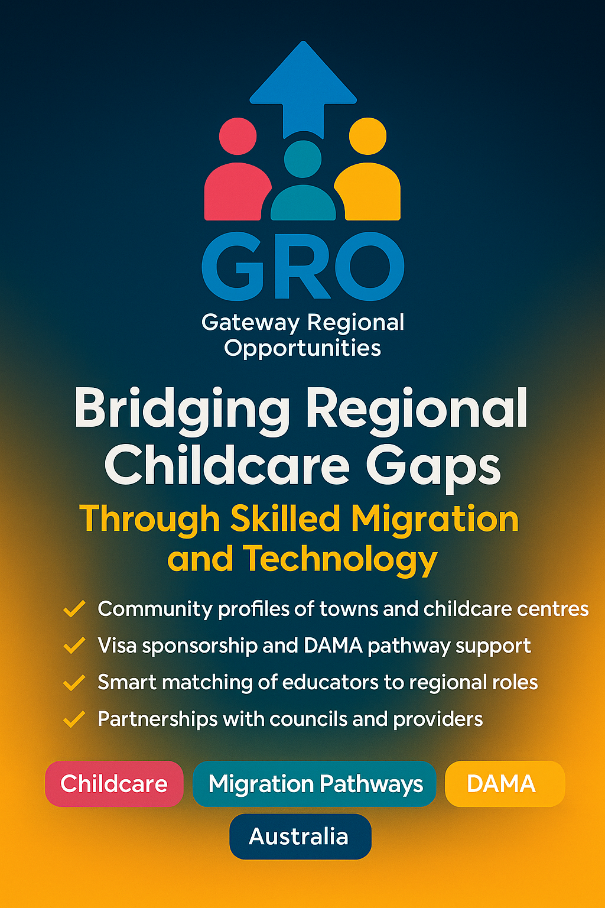

# Rural Childcare Sponsorship Navigator
---
<p align="center">
  <a href="images/GRO.jpeg">
    
  </a>
</p>

<p align="center"><em>Bridging regional talent gaps with digital innovation in early education.</em></p>

---

## Overview

**Rural Childcare Sponsorship Navigator** is a digital platform that addresses Australia’s rural childcare staffing challenges by connecting regional providers with qualified international educators. The platform streamlines skilled migration pathways and visa sponsorship, using automation, actionable guidance, and community insights to foster sustainable childcare solutions across regional Australia.

---

## Key Features

* **Smart Matching Dashboard**
  Intelligent algorithm matches providers with educators based on location, visa eligibility, qualifications, and preferences.
* **Visa & Sponsorship Tracker**
  End-to-end application tracking, deadline notifications, and process transparency for all major visa subclasses.
* **Secure Document Vault**
  Encrypted file management with integrated checklists for compliance at every stage.
* **Regional Community Hub**
  Interactive map and town profiles highlighting housing, amenities, and local childcare demand.
* **Australian ECEC Standards & Accreditation**
  Modular guides for frameworks (EYLF, NQF, NQS) and step-by-step overseas qualification assessment.
* **Direct Messaging Portal**
  Secure in-app communications for interviews, onboarding, and collaboration.
* **Grant Tracker**
  Visualize funding opportunities, monitor application progress, and meet deadlines for relevant grants.
* **Demand Forecaster**
  AI-powered forecasting tool for anticipating educator demand in regional communities.

---

## Technical Architecture

### Microservices-Based Backend

* **Authentication Service:** OAuth2.0 + JWT for user sessions.
* **Matching Service:** Python (FastAPI) for smart matching logic.
* **Visa Tracker Service:** Node.js (NestJS) for workflow automation.
* **Document Vault Service:** Go (Gin) with encrypted AWS KMS + S3 storage.
* **Community Hub Service:** Java (Spring Boot) for region/map endpoints.
* **Messaging Service:** Elixir (Phoenix) for secure real-time chat.
* **API Gateway:** AWS API Gateway with Lambda authorization.
* **Event Bus:** Kafka for events (e.g., status changes, new matches).

#### Database Layer

* **Relational:** PostgreSQL for core entities.
* **NoSQL:** DynamoDB for metadata.
* **Search:** Elasticsearch for fast search/filter.

### Frontend

* **Web App:** React + TypeScript, Redux Toolkit, React Query.
* **Mobile App:** React Native/Flutter (optional, for iOS/Android).
* **UI Components:** Tailwind CSS, shadcn/ui.
* **Mapping:** Mapbox GL JS for regions and town overlays.

### Infrastructure & DevOps

* **Containerization:** Docker + AWS ECS Fargate.
* **CI/CD:** GitHub Actions for build/test/deploy.
* **Monitoring:** Prometheus, Grafana, ELK stack.
* **Authentication:** AWS Cognito/Auth0.
* **Secrets Management:** AWS Secrets Manager.
* **CDN:** CloudFront.
* **DNS & SSL:** Route 53, ACM.

---

## Technology Stack Suggestions

| Layer                   | Technology                                | Rationale                                           |
| ----------------------- | ----------------------------------------- | --------------------------------------------------- |
| API Gateway             | AWS API Gateway                           | Centralized routing & authentication                |
| Authentication          | Auth0 / AWS Cognito                       | Scalable and secure user management                 |
| Microservices           | FastAPI, NestJS, Go, Spring Boot, Phoenix | Language-optimized services per domain              |
| Data Storage            | PostgreSQL, DynamoDB, Elasticsearch       | Optimal for relational, metadata, and search        |
| Messaging               | Kafka, Phoenix Channels                   | Reliable event handling and real-time communication |
| Frontend                | React/TypeScript, React Native/Flutter    | Consistent cross-platform user experience           |
| Container Orchestration | AWS ECS Fargate                           | Serverless containers with minimal overhead         |
| CI/CD                   | GitHub Actions                            | Streamlined development workflows                   |

---

## UI/UX Wireframes

**1. Provider Dashboard (Web)**

```
+----------------------------------------------------------+
| Navbar: Home | Matches | Visa Tracker | Docs Vault | Chat |
+----------------------------------------------------------+
| [Matches List]               | [Map View]                |
| - Educator A (Score: 92)     | [Australia Regions Map]   |
| - Educator B (Score: 87)     |  • Clickable markers      |
| - Educator C (Score: 75)     |  • Sidebar region details |
+----------------------------------------------------------+
```

**2. Educator Onboarding (Mobile)**

```
+-----------------------------+
| Stepper: Profile → Qualifications → Regions             |
+-----------------------------+
| [Profile Photo] [Name etc.]                             |
| [Qualifications Upload Button]                          |
| [Map selector for preferred locations]                  |
|              [Next Button]                              |
+-----------------------------+
```

**3. Visa & Sponsorship Tracker (Web)**

```
+-------------------------------------------------------+
| Timeline: Application Submitted → Assessment → Approval |
+-------------------------------------------------------+
| • 01 Jun 2025: Form 482 submitted                      |
| • 10 Jun 2025: Skills assessment completed             |
| • 20 Jun 2025: ETA decision pending                    |
| [Notifications Panel]                                  |
+-------------------------------------------------------+
```

**4. Grant Tracker (Web)**

```
+------------------------------------------------------------+
| Navbar: Dashboard | Matches | Visa Tracker | Grant Tracker |
+------------------------------------------------------------+
| [Grant Overview Card]          | [Active Grants List]      |
| - Grant Name                   | - Grant A: Status ✓       |
| - Funding Amount               | - Grant B: Pending Review |
| - Deadline                     | - Grant C: Submitted ✓    |
+------------------------------------------------------------+
| [Grant Details Panel]                                      |
| • Application Steps with progress dots                     |
| • Document checklist sidebar                               |
+------------------------------------------------------------+
```

**5. Demand Forecaster (Web)**

```
+------------------------------------------------------------+
| Navbar: Dashboard | Demand Forecaster | Docs Vault | Chat   |
+------------------------------------------------------------+
| [Forecast Chart: Childcare Demand by Region (Next 12m)]    |
| • Interactive line/bar toggle                              |
| • Region dropdown filter                                   |
+------------------------------------------------------------+
| [Insights Panel]                                           |
| • Top 3 Regions projected to need >10 educators            |
| • Seasonality heatmap                                      |
+------------------------------------------------------------+
```

---

## Getting Started

### Prerequisites

* Node.js and npm installed

### Installation

1. **Clone the repository:**

   ```bash
   git clone https://github.com/Camerongmccallum24/RecPortalau.git
   cd RecPortalau
   ```
2. **Install dependencies:**

   ```bash
   npm install
   ```
3. **Start the development server:**

   ```bash
   npm start
   ```
4. **Build for production:**

   ```bash
   npm run build
   ```

The site is hosted on [GitHub Pages](https://camerongmccallum24.github.io/RecPortalau/). You can view the live project [here](https://camerongmccallum24.github.io/RecPortalau/).

---

## Usage

* Navigate to the [live site](https://camerongmccallum24.github.io/RecPortalau/)
* Choose your persona (employer, candidate, council) to access tailored guides and onboarding
* Explore dashboards, sponsorship tools, and community resources

---

## Contributing

Pull requests, feedback, and feature suggestions are welcome! Please open an issue or submit a pull request.

---

## License

[MIT](LICENSE)

---

*Created by Cameron McCallum*
